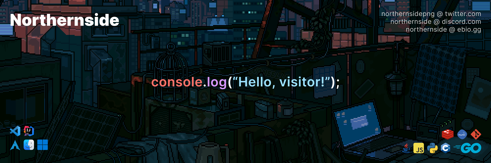

<h1 align="center">
Hi there, I'm Northernside! 👋
</h1>
<h3 align="center">My name is Elias, I'm 15 years old and I'm living near Frankfurt, Germany.</h3>
<h4 align="center"><i>A young inspired developer from Germany.</i></h4>

### Connect with me 🤝

    

      
    

    

      
    

    

      
    

    

      
    

### Technologies I use 📱

[-%23239120.svg?style=for-the-badge&logo=c-sharp&logoColor=white)](https://docs.microsoft.com/en-us/dotnet/csharp/)
  

[-%23777BB4.svg?style=for-the-badge&logo=php&logoColor=white)](https://www.php.net/)

[%232496ED.svg?style=for-the-badge&logo=docker&logoColor=white)](https://www.docker.com/)
[%23009639.svg?style=for-the-badge&logo=nginx&logoColor=white)](https://www.nginx.com/)

[F05033.svg?style=for-the-badge&logo=git&logoColor=white)](https://git-scm.com/)

### Coding Stats 📈

  

 

